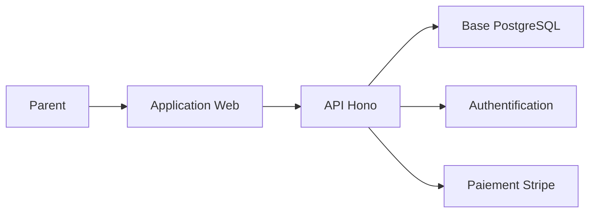
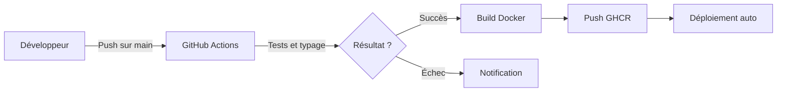

# Tokō

Application web qui aide les parents à suivre et accompagner leur enfant TDAH (Trouble du Déficit de l'Attention avec ou sans Hyperactivité) au quotidien.

## Table des matières

- [À quoi sert ce produit ?](#à-quoi-sert-ce-produit-)
- [Fonctionnalités principales](#fonctionnalités-principales)
- [Comment ça fonctionne](#comment-ça-fonctionne)
- [Environnements](#environnements)
- [Déploiement](#déploiement)
- [Stack technique](#stack-technique)
- [Documentation complémentaire](#documentation-complémentaire)

### Documentation technique

| Document | Description |
|----------|-------------|
| [Architecture](docs/architecture.md) | Architecture monorepo et flux de données entre packages |
| [Authentification](docs/authentication.md) | Flux de connexion Better Auth, sessions et protection des routes |
| [Programme Barkley](docs/barkley-program.md) | Programme d'entraînement parental PEHP et tableau de récompenses |
| [Schéma de base de données](docs/database-schema.md) | Structure des tables PostgreSQL et relations |
| [Déploiement](docs/deployment.md) | Guide Docker, variables d'environnement et pipeline CI/CD |
| [Intégration Stripe](docs/stripe-billing.md) | Abonnements, paiements et webhooks Stripe |

## À quoi sert ce produit ?

- Suivre les symptômes TDAH de votre enfant au quotidien sur 7 dimensions
- Gérer les traitements médicamenteux et le suivi d'observance
- Tenir un journal d'observations avec humeur et étiquettes
- Planifier et organiser les rendez-vous médicaux
- Mettre en place le programme Barkley (PEHP) avec tableau de récompenses
- Générer des rapports médicaux pour les consultations

## Fonctionnalités principales

- **Suivi des symptômes** — Évaluation quotidienne sur 7 axes : agitation, concentration, impulsivité, régulation émotionnelle, sommeil, comportement social et autonomie
- **Gestion des médicaments** — Création de traitements avec posologie et suivi de la prise quotidienne
- **Journal d'observations** — Notes libres avec humeur (4 niveaux) et étiquettes thématiques (école, victoire, crise, sport, thérapie, etc.)
- **Rendez-vous médicaux** — Agenda avec 7 types de rendez-vous (neurologue, orthophoniste, psychologue, PAP/PPS scolaire, pédiatre)
- **Programme Barkley** — Tableau de récompenses hebdomadaire et suivi des 10 étapes du programme d'entraînement parental
- **Tableau de bord** — Vue synthétique avec statistiques, séries d'observance et graphique des symptômes
- **Rapports médicaux** — Génération de bilans pour les professionnels de santé sur une période choisie
- **Multi-enfants** — Gestion de plusieurs profils enfants par compte parent
- **Conformité RGPD** — Export des données personnelles et suppression de compte

## Comment ça fonctionne

Le parent accède à l'application web depuis son navigateur. L'interface communique avec l'API backend. L'API gère la logique métier, l'authentification et stocke les données en base PostgreSQL.

## Environnements

| Environnement | URL | Description |
|---------------|-----|-------------|
| Développement | `http://localhost:5173` (web) / `http://localhost:3001` (API) | Environnement local |
| Production | `https://toko.battistella.ovh` | Environnement de production |

## Déploiement

Le pipeline CI/CD (Intégration et Déploiement Continus) se déclenche à chaque push sur la branche principale. Les tests et la vérification de typage s'exécutent en premier. Si tout passe, une image Docker est construite et poussée sur le registre GitHub. Le déploiement s'effectue automatiquement sur le serveur de production.

La version est déterminée automatiquement par les commits conventionnels :
- `feat:` déclenche une version mineure
- `fix:` déclenche un correctif
- `feat!:` ou `BREAKING CHANGE:` déclenche une version majeure

## Stack technique

- **Frontend :** React 19, TypeScript, TailwindCSS 4, TanStack Router, TanStack React Query, Zustand, Recharts
- **Backend :** Node.js 22, Hono, Better Auth, Drizzle ORM, Stripe
- **Base de données :** PostgreSQL 16
- **Validation :** Zod (partagé frontend/backend)
- **Infrastructure :** Docker, GitHub Actions, Traefik, pnpm + Turborepo (monorepo)

## Documentation complémentaire

La documentation technique détaillée se trouve dans le dossier `docs/` :

- [Architecture](docs/architecture.md) — Structure du monorepo et flux de données
- [Authentification](docs/authentication.md) — Better Auth, sessions, OAuth Google
- [Programme Barkley](docs/barkley-program.md) — PEHP en 10 étapes et tableau de récompenses
- [Schéma de base de données](docs/database-schema.md) — Tables PostgreSQL et relations
- [Déploiement](docs/deployment.md) — Docker, CI/CD et mise en production
- [Intégration Stripe](docs/stripe-billing.md) — Abonnements et paiements
