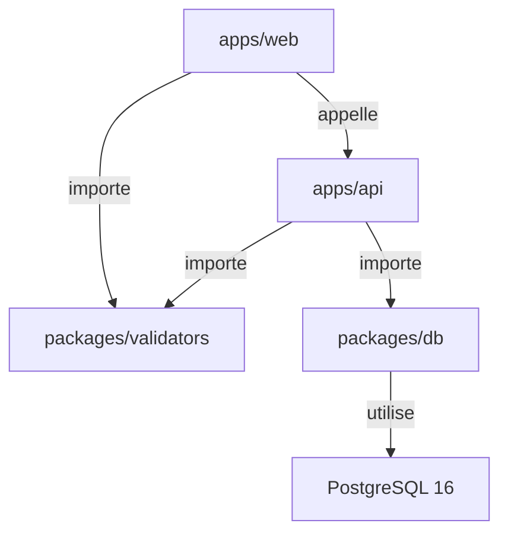
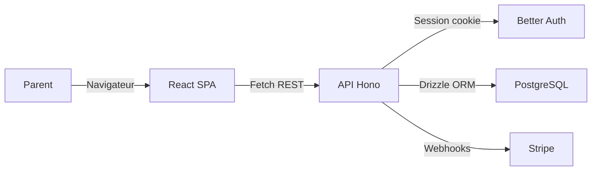
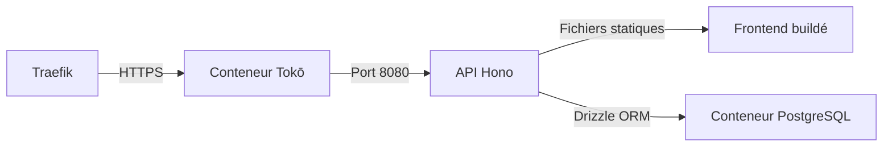

# Architecture

Vue d'ensemble de l'architecture monorepo Tokō et des flux de données entre les différents packages.

## Structure du monorepo

Tokō est organisé en monorepo géré par **pnpm workspaces** et **Turborepo**.



Le frontend et le backend partagent les schémas de validation Zod. Seul le backend accède à la base de données via le package `@focusflow/db`.

## Packages internes

| Package | Nom npm | Rôle |
|---------|---------|------|
| `apps/web` | `@focusflow/web` | Interface utilisateur React (SPA) |
| `apps/api` | `@focusflow/api` | API REST Hono |
| `packages/db` | `@focusflow/db` | Schéma Drizzle ORM, migrations, connexion PostgreSQL |
| `packages/validators` | `@focusflow/validators` | Schémas Zod partagés entre frontend et backend |

> **Détail technique** — Les packages internes ne sont pas pré-buildés. Le backend utilise **tsx** pour transpiler TypeScript au runtime. Le frontend les importe directement via Vite.

## Flux de données



1. Le parent interagit avec l'application React dans son navigateur
2. L'application envoie des requêtes REST à l'API Hono
3. L'API vérifie la session via Better Auth (cookie de session)
4. Les données sont lues et écrites en base PostgreSQL via Drizzle ORM
5. Les paiements sont gérés par Stripe via webhooks

## Frontend — Couches applicatives

- **Routes** (`apps/web/src/routes/`) — Routage fichier TanStack Router
- **Hooks** (`apps/web/src/hooks/`) — Un fichier par domaine, encapsule React Query
- **Composants** (`apps/web/src/components/`) — Composants UI (shadcn/ui) et composants métier
- **Stores** (`apps/web/src/stores/`) — État client Zustand (sélection enfant, sidebar)
- **Lib** (`apps/web/src/lib/`) — Client API, client auth, utilitaires

## Backend — Couches applicatives

- **Routes** (`apps/api/src/routes/`) — Un fichier par domaine (children, symptoms, medications, etc.)
- **Middleware** (`apps/api/src/middleware/`) — Authentification et gestion d'erreurs
- **Lib** (`apps/api/src/lib/`) — Configuration auth, client Stripe

## Sécurité des données

Chaque requête sur les données d'un enfant vérifie que l'utilisateur connecté est bien le parent :

```
WHERE children.id = :childId AND children.parentId = :userId
```

Cette vérification est systématique dans toutes les routes protégées.

## Production — Conteneur unique



En production, un seul conteneur Docker sert à la fois l'API et le frontend. L'API Hono distribue les fichiers statiques du frontend buildé. Traefik gère le HTTPS et le routage.
