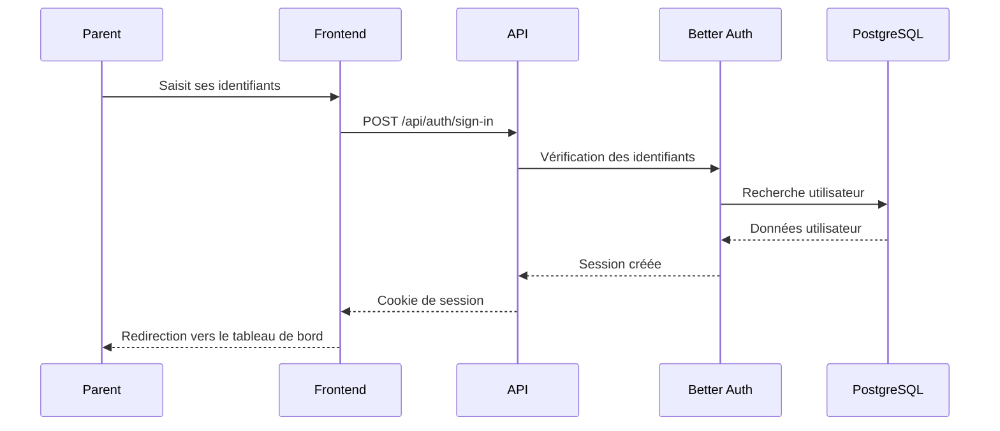

# Authentification

Système d'authentification de Tokō basé sur **Better Auth**. Ce document explique les méthodes de connexion, la gestion des sessions et la protection des routes.

## Méthodes de connexion

Tokō propose deux méthodes d'authentification :

- **Email / mot de passe** — Inscription et connexion classiques
- **Google OAuth** — Connexion via compte Google (optionnel, nécessite la configuration des clés)

Un compte démo est disponible : `demo@toko.app` / `demo1234`.

## Flux de connexion

Le parent saisit ses identifiants sur la page de connexion. Better Auth vérifie les données en base et crée une session. Un cookie sécurisé est renvoyé au navigateur.

## Configuration

Les variables d'environnement nécessaires :

| Variable | Rôle | Obligatoire |
|----------|------|-------------|
| `BETTER_AUTH_SECRET` | Clé de chiffrement des sessions (min. 32 caractères) | Oui |
| `BETTER_AUTH_URL` | URL de base de l'API | Oui |
| `GOOGLE_CLIENT_ID` | Identifiant OAuth Google | Non |
| `GOOGLE_CLIENT_SECRET` | Secret OAuth Google | Non |

> **Détail technique** — La clé `BETTER_AUTH_SECRET` doit être générée avec `openssl rand -base64 32`. Ne jamais la commiter dans le code source.

## Sessions

- **Durée** : 30 jours
- **Stockage** : Cookie HTTP sécurisé
- **Cache** : Activé côté serveur (5 minutes) pour éviter les requêtes base à chaque appel
- **Tables** : `session` (tokens actifs) et `account` (providers OAuth)

## Protection des routes

### Côté backend

Le middleware `apps/api/src/middleware/auth.ts` vérifie la session sur chaque route protégée. Il extrait le cookie de session, valide le token via Better Auth et injecte l'utilisateur dans le contexte Hono. Si la session est invalide, une erreur 401 est renvoyée.

### Côté frontend

Le layout `_authenticated.tsx` utilise le hook `beforeLoad` de TanStack Router. Avant chaque navigation vers une route protégée, il appelle `authClient.getSession()`. Si aucune session n'existe, l'utilisateur est redirigé vers `/login`.

## Routes publiques

Les pages suivantes sont accessibles sans authentification :

- `/` — Page d'accueil
- `/login` — Connexion et inscription
- `/mentions-legales` — Mentions légales
- `/confidentialite` — Politique de confidentialité
- `/contact` — Page de contact
