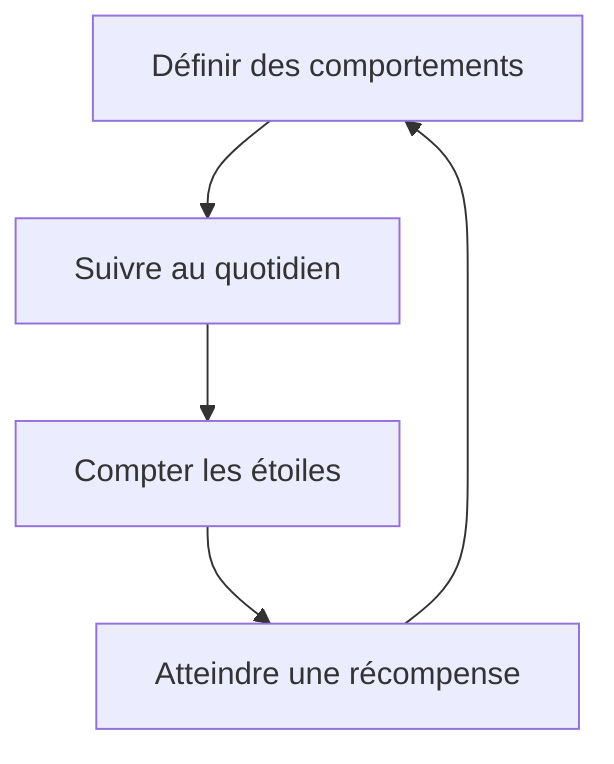
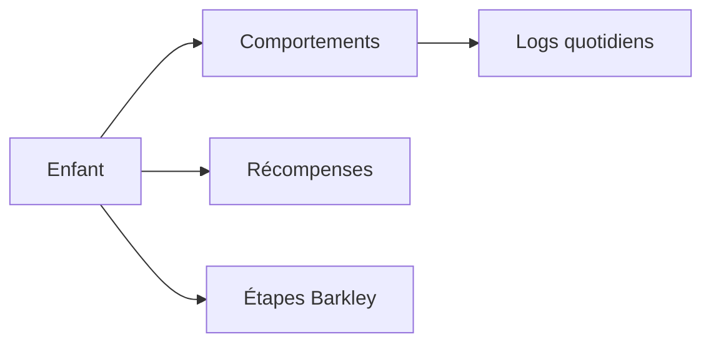

# Programme Barkley (PEHP)

Fonctionnement du module Barkley dans Tokō. Ce programme d'entraînement aux habiletés parentales (PEHP) aide les parents à mettre en place des stratégies éducatives adaptées au TDAH.

## Qu'est-ce que le programme Barkley ?

Le programme Barkley est un **Programme d'Entraînement aux Habiletés Parentales** en 10 étapes. Il enseigne aux parents des techniques pour :

- Renforcer les comportements positifs de l'enfant
- Réduire les comportements problématiques
- Améliorer la relation parent-enfant

## Deux fonctionnalités complémentaires

Tokō propose deux outils pour accompagner le programme :

### 1. Suivi des 10 étapes

Le parent progresse à travers les 10 étapes du programme Barkley. Chaque étape peut être marquée comme complétée avec une date et des notes personnelles.

Les étapes couvrent des thématiques comme l'attention positive, le système de récompenses, le temps de pause et la gestion des comportements en public.

### 2. Tableau de récompenses

Le tableau de récompenses est un outil hebdomadaire qui fonctionne en 4 temps :

1. **Comportements** — Le parent définit les comportements à encourager (ex : ranger ses affaires, se brosser les dents)
2. **Suivi quotidien** — Chaque jour, le parent coche les comportements accomplis
3. **Étoiles** — Chaque comportement accompli vaut des points (étoiles)
4. **Récompenses** — Le parent définit des récompenses atteignables avec les étoiles accumulées

## Modèle de données

- **Comportements** (`barkley_behaviors`) — Nom, icône emoji, points, ordre d'affichage
- **Logs quotidiens** (`barkley_behavior_logs`) — Un enregistrement par comportement et par jour (accompli ou non)
- **Récompenses** (`barkley_rewards`) — Nom et icône emoji
- **Étapes** (`barkley_steps`) — Numéro d'étape (1-10), date de complétion, notes

Chaque élément est lié à un enfant spécifique. La contrainte d'unicité sur `(behaviorId, date)` empêche les doublons de suivi.

## Principes clés affichés

L'interface rappelle 5 principes fondamentaux du programme :

- **Immédiateté** — Réagir rapidement après le comportement
- **Positivité** — Valoriser les réussites plutôt que punir les échecs
- **Régularité** — Appliquer le système chaque jour
- **Progressivité** — Augmenter les attentes graduellement
- **Valorisation** — Célébrer chaque progrès, même petit
