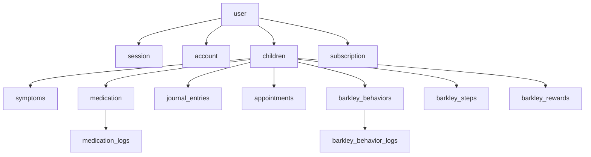

# Schéma de base de données

Structure des tables PostgreSQL de Tokō, gérées par **Drizzle ORM**. Les schémas sont définis dans `packages/db/src/schema/`.

## Vue d'ensemble

Toutes les données métier sont rattachées à un **enfant** (`children`), lui-même rattaché à un **utilisateur** (`user`).

## Tables d'authentification

Gérées par Better Auth :

| Table | Rôle |
|-------|------|
| `user` | Comptes utilisateurs (nom, email, image) |
| `session` | Sessions actives (token, expiration, IP, user agent) |
| `account` | Comptes OAuth liés (provider, tokens) |
| `verification` | Codes de vérification email |

## Tables métier

### `children` — Profils enfants

| Colonne | Type | Description |
|---------|------|-------------|
| `id` | UUID | Identifiant unique |
| `parentId` | UUID (FK user) | Parent propriétaire |
| `name` | Texte | Prénom ou surnom |
| `birthDate` | Date | Date de naissance |
| `gender` | Enum | `male`, `female`, `other` |
| `diagnosisType` | Enum | `inattentive`, `hyperactive`, `mixed`, `undefined` |

### `symptoms` — Suivi des symptômes

7 dimensions évaluées de 0 à 10 :

| Colonne | Description |
|---------|-------------|
| `agitation` | Niveau d'agitation |
| `focus` | Capacité de concentration |
| `impulse` | Niveau d'impulsivité |
| `mood` | Régulation émotionnelle |
| `sleep` | Qualité du sommeil |
| `social` | Comportement social |
| `autonomy` | Niveau d'autonomie |

Champs optionnels : `context` (ex : journée d'école) et `notes`.

### `medication` — Traitements

| Colonne | Type | Description |
|---------|------|-------------|
| `name` | Texte | Nom du médicament |
| `dose` | Texte | Posologie |
| `scheduledAt` | Texte (HH:MM) | Heure de prise prévue |
| `active` | Booléen | Traitement en cours ou arrêté |

### `medication_logs` — Suivi de prise

| Colonne | Type | Description |
|---------|------|-------------|
| `medicationId` | UUID (FK) | Médicament concerné |
| `date` | Date | Jour de la prise |
| `status` | Enum | `taken`, `skipped`, `delayed` |
| `takenAt` | Timestamp | Heure effective de prise |

### `journal_entries` — Journal d'observations

| Colonne | Type | Description |
|---------|------|-------------|
| `text` | Texte (1-5000) | Contenu de l'observation |
| `moodRating` | Entier (1-4) | Humeur du jour |
| `tags` | JSON (tableau) | Étiquettes : `school`, `victory`, `crisis`, `medication`, `sleep`, `sport`, `therapy` |

### `appointments` — Rendez-vous

| Colonne | Type | Description |
|---------|------|-------------|
| `title` | Texte | Intitulé du rendez-vous |
| `type` | Enum | `neurologist`, `speech_therapist`, `psychologist`, `school_pap`, `school_pps`, `pediatrician`, `other` |
| `date` | Timestamp | Date et heure |
| `location` | Texte | Lieu (optionnel) |
| `notes` | Texte | Notes (optionnel) |

### Tables Barkley

- **`barkley_steps`** — Progression (étapes 1-10, `completedAt`, notes)
- **`barkley_behaviors`** — Comportements à suivre (nom, icône, points, ordre)
- **`barkley_behavior_logs`** — Suivi quotidien (comportement + date, unique)
- **`barkley_rewards`** — Récompenses définies (nom, icône, ordre)

### `subscription` — Abonnements Stripe

| Colonne | Type | Description |
|---------|------|-------------|
| `stripeCustomerId` | Texte | Identifiant client Stripe |
| `stripeSubscriptionId` | Texte (unique) | Identifiant abonnement |
| `status` | Texte | Statut (`active`, `canceled`, etc.) |
| `planId` | Texte | Identifiant du plan tarifaire |
| `currentPeriodEnd` | Timestamp | Fin de la période en cours |

## Migrations

Les migrations SQL se trouvent dans `packages/db/drizzle/`. Elles sont générées par `pnpm db:generate` et s'exécutent automatiquement au démarrage de l'API.

> **Détail technique** — Ne jamais modifier manuellement un fichier de migration existant. Modifier le schéma dans `packages/db/src/schema/` puis générer une nouvelle migration.
