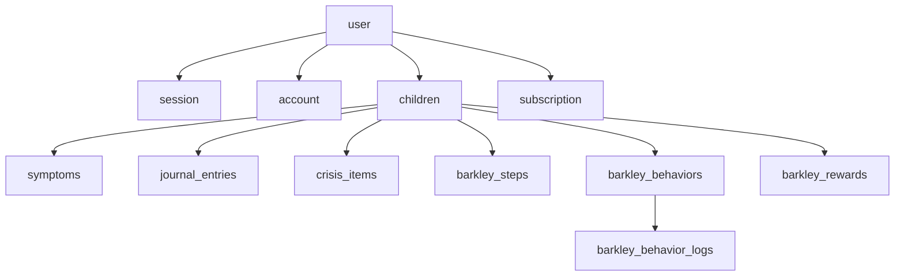

# Schéma de base de données

Structure des tables PostgreSQL de Tokō, gérées par **Drizzle ORM**. Les schémas sont définis dans `packages/db/src/schema/`.

## Vue d'ensemble

Toutes les données métier sont rattachées à un **enfant** (`children`), lui-même rattaché à un **utilisateur** (`user`). Les suppressions sont propagées en cascade.

## Tables d'authentification

Gérées par Better Auth :

| Table | Rôle |
|-------|------|
| `user` | Comptes utilisateurs (nom, email, image) |
| `session` | Sessions actives (token, expiration, IP, user agent) |
| `account` | Comptes OAuth liés (provider, tokens) |
| `verification` | Codes de vérification email |

## Tables métier

### `children` — Profils enfants

| Colonne | Type | Description |
|---------|------|-------------|
| `id` | UUID | Identifiant unique |
| `parentId` | UUID (FK user) | Parent propriétaire |
| `name` | Texte | Prénom ou surnom |
| `birthDate` | Date | Date de naissance |
| `gender` | Enum | `male`, `female`, `other` |
| `diagnosisType` | Enum | `inattentive`, `hyperactive`, `mixed`, `undefined` |

Index : `children_parent_id_idx` sur `parentId`.

### `symptoms` — Suivi des symptômes

7 dimensions évaluées de 0 à 10 :

| Colonne | Description |
|---------|-------------|
| `agitation` | Niveau d'agitation |
| `focus` | Capacité de concentration |
| `impulse` | Niveau d'impulsivité |
| `mood` | Régulation émotionnelle |
| `sleep` | Qualité du sommeil |
| `social` | Comportement social |
| `autonomy` | Niveau d'autonomie |

Champs optionnels : `context` (ex : journée d'école) et `notes`.
Index composite `symptoms_child_id_date_idx` sur `(childId, date)`.

### `journal_entries` — Journal d'observations

| Colonne | Type | Description |
|---------|------|-------------|
| `text` | Texte (1-5000) | Contenu de l'observation |
| `moodRating` | Entier (1-4) | Humeur du jour (requis) |
| `tags` | JSON (tableau) | Étiquettes : `school`, `victory`, `crisis`, `medication`, `sleep`, `sport`, `therapy` |

Index composite `journal_entries_child_id_date_idx` sur `(childId, date)`.

### `crisis_items` — Liste de crise

Liste d'activités apaisantes construites avec l'enfant, consultables en mode plein écran pendant les crises.

| Colonne | Type | Description |
|---------|------|-------------|
| `label` | Texte | Activité apaisante |
| `emoji` | Texte (optionnel) | Emoji d'illustration |
| `position` | Entier | Ordre dans la liste (drag-and-drop) |

### Tables Barkley

- **`barkley_steps`** — Progression (étapes 1-10, `completedAt`, notes). Contrainte unique sur `(childId, stepNumber)`.
- **`barkley_behaviors`** — Comportements à suivre (nom, icône, points, ordre, actif)
- **`barkley_behavior_logs`** — Suivi quotidien (contrainte unique sur `(behaviorId, date)`)
- **`barkley_rewards`** — Récompenses (nom, icône, `starsRequired`, `claimedAt`, ordre)

Chaque table Barkley possède un index sur `childId` (ou `behaviorId` pour les logs).

### `subscription` — Abonnements Stripe

| Colonne | Type | Description |
|---------|------|-------------|
| `stripeCustomerId` | Texte | Identifiant client Stripe |
| `stripeSubscriptionId` | Texte (unique) | Identifiant abonnement |
| `status` | Texte | Statut (`active`, `trialing`, `canceled`, etc.) |
| `planId` | Texte | Identifiant du plan tarifaire |
| `currentPeriodEnd` | Timestamp | Fin de la période en cours |

Index : `subscription_user_id_idx` sur `userId`.

## Migrations

Les migrations SQL se trouvent dans `packages/db/drizzle/`. Elles sont générées par `pnpm db:generate` et s'exécutent automatiquement au démarrage de l'API.

> **Détail technique** — Ne jamais modifier manuellement un fichier de migration existant. Modifier le schéma dans `packages/db/src/schema/` puis générer une nouvelle migration.
