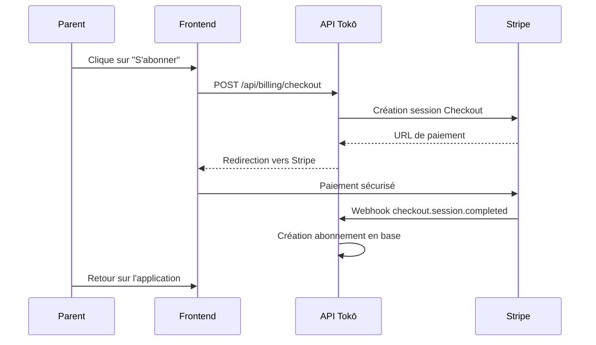

# Intégration Stripe

Gestion des abonnements et paiements dans Tokō via **Stripe**. Ce document décrit le modèle tarifaire, le flux de paiement et la gestion des webhooks.

## Modèle tarifaire

Tokō propose deux plans :

| Plan | Prix | Inclus |
|------|------|--------|
| **Gratuit** | 0 € | 1 profil enfant |
| **Famille** | 4,99 €/mois | 3 profils enfants |

## Flux de paiement



Le parent est redirigé vers la page de paiement hébergée par Stripe. Après paiement, Stripe notifie Tokō via webhook.

## Endpoints API

| Route | Méthode | Rôle |
|-------|---------|------|
| `/api/billing/checkout` | POST | Crée une session Stripe Checkout |
| `/api/billing/status` | GET | Vérifie le statut d'abonnement |
| `/api/billing/stripe/webhook` | POST | Reçoit les événements Stripe |

## Webhooks Stripe

Trois événements sont traités :

- **`checkout.session.completed`** — Paiement réussi, création de l'abonnement en base
- **`customer.subscription.updated`** — Changement de plan ou renouvellement
- **`customer.subscription.deleted`** — Annulation de l'abonnement

> **Détail technique** — Le webhook est monté avant le middleware CORS dans la chaîne Hono. Stripe requiert le body brut (non parsé) pour valider la signature.

## Configuration locale (Stripe CLI)

### Prérequis

1. Installer le [Stripe CLI](https://docs.stripe.com/stripe-cli#install)
2. S'authentifier : `stripe login`

### Créer le produit et le prix

```bash
pnpm stripe:setup
```

Ce script idempotent :
- Crée le produit **Tokō Famille** (ou réutilise l'existant via metadata `toko_plan=famille`)
- Crée le prix **4,99€/mois** avec le `lookup_key` `toko_famille_monthly` (ou réutilise l'existant)
- Aucune variable d'environnement à copier — l'API résout le price ID au runtime via `stripe.prices.list({ lookup_keys })`. Pour remplacer le prix (changement de montant par exemple), créez un nouveau prix avec `--lookup-key toko_famille_monthly --transfer-lookup-key` : aucun changement de code ni de `.env` requis.

> **Sécurité** — Le script refuse de s'exécuter avec une clé `sk_live_*`.

### Webhook local

Dans un terminal séparé :

```bash
pnpm stripe:listen
```

Copiez le `whsec_...` affiché dans `STRIPE_WEBHOOK_SECRET` de votre `.env`.

> **Note** — Le secret webhook change à chaque lancement de `stripe listen`.

## Variables d'environnement

| Variable | Côté | Description |
|----------|------|-------------|
| `STRIPE_SECRET_KEY` | Backend | Clé secrète API Stripe |
| `STRIPE_WEBHOOK_SECRET` | Backend | Secret de validation des webhooks |
| `VITE_STRIPE_PUBLISHABLE_KEY` | Frontend | Clé publique Stripe |

> **Plan tarifaire** — Le price ID n'est **pas** stocké en variable d'environnement. L'API le résout au runtime via le `lookup_key` `toko_famille_monthly` (cache en mémoire 5 min). Voir `apps/api/src/lib/stripe.ts` (`PRICE_LOOKUP_KEYS`).

## Table `subscription`

L'abonnement est stocké en base et lié à l'utilisateur :

- `stripeCustomerId` — Identifiant client Stripe
- `stripeSubscriptionId` — Identifiant unique de l'abonnement
- `status` — Statut actuel (`active`, `canceled`, etc.)
- `currentPeriodEnd` — Date de fin de la période en cours

## Suppression de compte

Lors de la suppression d'un compte (RGPD), si l'utilisateur a un abonnement Stripe actif, celui-ci est automatiquement annulé avant la suppression des données.
